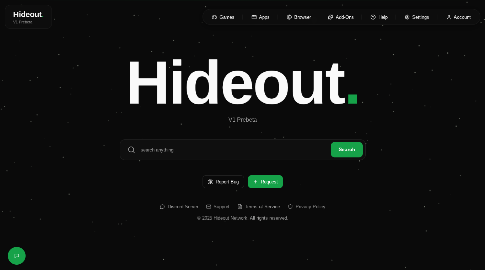

<div align="center">

# **Hideout**



**Hideout** is an open-source unblocked gaming platform featuring 200+ games, a secure proxy browser, real-time global chat, and customizable themes. Built for accessibility and performance with zero setup required.

---

## 🛠️ Developers

### Prerequisites
- **Node.js** (v18 or higher)
- **Git**

### Local Development

```bash
# Clone the repository
git clone https://github.com/Hideout-Network/hideout.git
cd hideout

# Install dependencies
npm install

# Start development server
npm run dev
```

The app will be available at `http://localhost:8080`

### Deployment

```bash
# Build for production
npm run build

# Preview production build
npm run preview
```

Deploy the `dist` folder to any static hosting service (Vercel, Netlify, GitHub Pages, etc.)

### Contributing Content

Want to contribute games, themes, or addons? Visit our assets repository:

**🎮 [hideout-assets](https://github.com/Hideout-Network/hideout-assets)**

Submit a pull request with your additions. Full contribution guidelines are available in that repository.

---

## 📚 Tech Stack

<div align="center">


</div>

---

## 🔗 Quick Links

<div align="center">

[](https://github.com/Hideout-Network/hideout/stargazers)
[](https://discord.gg/HkbVraQH89)
[](https://github.com/Hideout-Network/hideout/issues/new)
[](LICENSE)

</div>

---

## 📜 License

© 2025 Hideout Network. All rights reserved.

Released under the [MIT License](LICENSE) - free to use, modify, and distribute.

---

<div align="center">

Made with 💚 by the Hideout Network Team

</div>
